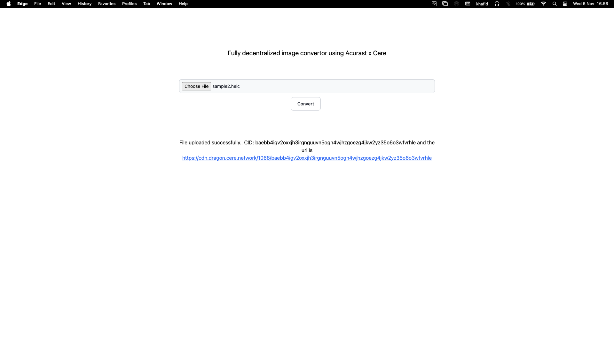

# About

Summary: a very simple bounty that combines the Acurast image conversion use-case with Cere Network's image storage use-case, in which a HEIC file is converted to a PNG. Using fully decentralized storage & compute.

Expected result:

1. Create a developer account on https://developer.console.cere.network
2. Create a public bucket using the developer console
3. Create a simple website with a folder browser and a "convert" button
4. Allow the user to upload a HEIC image file into your bucket
5. Allow the user to press the "convert" button which takes the HEIC file from your bucket and sends it to Acurast for compute/conversion
6. Write the output (a new PNG file) to your bucket
7. Present the user with a download/share link for his new PNG file

## Resources

Developer console: https://developer.console.cere.network/

Acurast Image Conversion Repo: https://github.com/Acurast/acurast-example-apps/blob/main/apps/app-heic-to-png/src/index.ts

Cere Network DDC example: https://github.com/Cerebellum-Network/cere-ddc-sdk-js/tree/main/examples

Cere Network DDC SDK: https://github.com/Cerebellum-Network/cere-ddc-sdk-js

## How to Run

1. Setup the credentials
   - wallet.json , from exported wallet data from cere
   - .env , adjust the env
2. Install Bun runtime for Node.js https://bun.sh/docs/installation
3. Run this command on shell

```
# installing package (run this at workspace)
bun install

# building frontend to interact with backend (run this at workspace)
bun run build

# change context of current working dir
cd ./server

# run server to render frontend and start endpoint `/upload` to process the file to blockchain
bun run ./server.mts yourpassphrase
```

Replace `yourpassphrase` when running server, because it use to decode the encoded wallet.json data

## How to Debug

1. Install extension on vscode marketplace "Bun for Visual Studio Code"
2. Open the `.vscode/launch.json`
3. Set your wallet secret replace `supersecret` with your passphrase at `args` object at debugger launch.json
4. Open `server.mts` file and run the debugger


## Build for Production
Current directory for build is `${workingspace}`
1. Make sure you have build the frontend, or you can run `bun run build`
2. Bundle the server code to single entrypoint Node.js app with `bun run build-server`
3. Change directory to `${workspace}/server`
4. Adjust the `wallet.json` and `.env`
5. Run at the `server` directory `node dist/server.js yourpassphrase` 

## Proof



```
File uploaded successfully.. CID: baebb4igv2oxxjh3irgnguuvn5ogh4wjhzgoezg4jkw2yz35o6o3wfvrhle and the url is https://cdn.dragon.cere.network/1068/baebb4igv2oxxjh3irgnguuvn5ogh4wjhzgoezg4jkw2yz35o6o3wfvrhle
```
